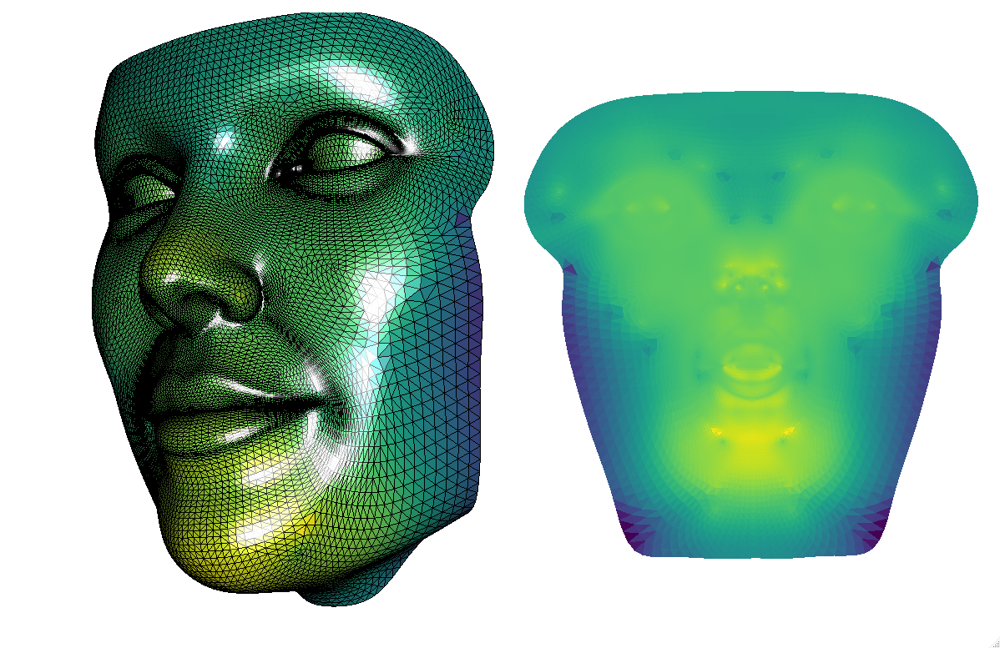

<!-- README.md is generated from README.Rmd. Please edit that file -->

```{r, include = FALSE}
knitr::opts_chunk$set(
  collapse = TRUE,
  comment = "#>",
  fig.path = "man/figures/README-",
  out.width = "100%"
)
```

# rbff

<!-- badges: start -->
[](https://lifecycle.r-lib.org/articles/stages.html#experimental)
[](https://github.com/rdinnager/rbff/actions)
<!-- badges: end -->

The goal of rbff is to provide an R wrapper around the awesome [boundary-first-flattening](https://geometrycollective.github.io/boundary-first-flattening/) software, which allows you to flatten and / or map a 3d object to a 2d shape (or a sphere).

## Installation

Before installing `rbff` you will need to make sure you have two system dependencies installed:

* OpenBLAS
* SuiteSparse

## Linux

In Linux, installing them should be straightforward with your distributions package manager. In Debian or Ubuntu for example you can simple use: 

```
sudo apt install libopenblas-dev
sudo apt install libsuitesparse-dev
```

## Mac OS

For Mac OS you can use Homebrew like this:

```
brew install openblas
brew install suite-sparse
```

## Windows

You can use the Rtools package manager to install `rbff`'s dependencies. First make sure Rtools 4.0 is installed. You can find installation instructions here: https://cran.r-project.org/bin/windows/Rtools/ 
Once Rtools 4.0 is on your system, use the start menu to find and open 'Rtools Bash'. This will open a msys2 window. Type in this window the following:

```
pacman -Sy
pacman -S mingw-w64-{x86_64,i686}-suitesparse
```

Once system dependencies are successfully installed, you can install the development version from [GitHub](https://github.com/) with:

``` r
# install.packages("devtools")
devtools::install_github("rdinnager/rbff")
```

Note that currently I have only tested `rbff` on Windows and Linux. Currently, Mac OS fails to even build `rbff` on github actions with a mysterious compilation failure. If you manage to install `rbff` on Mac, please let me know. If you have any installation trouble, please post an issue to this repo.

## Example

You can flatten a mesh with the `bff_flatten()` function. Using default arguments it tries to find a 2d shape to flatten a 3d mesh into that minimizes angle and area distortion.

```{r example}
library(rbff)

face_flat <- bff_flatten(face)
```

Visualise the area distortion in this flattening:

```{r vis_area, eval=FALSE}
bff_vis_metrics(flat_face, metric = "area distortion")
```



This package is still in the (very) early days of development.
